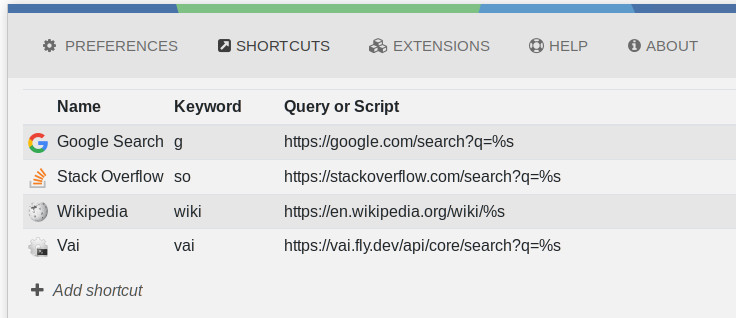
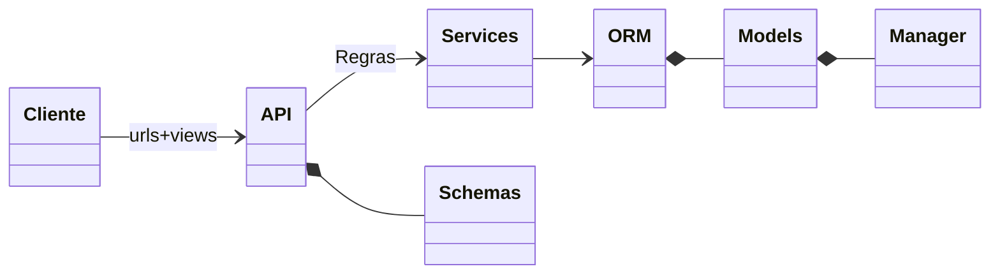
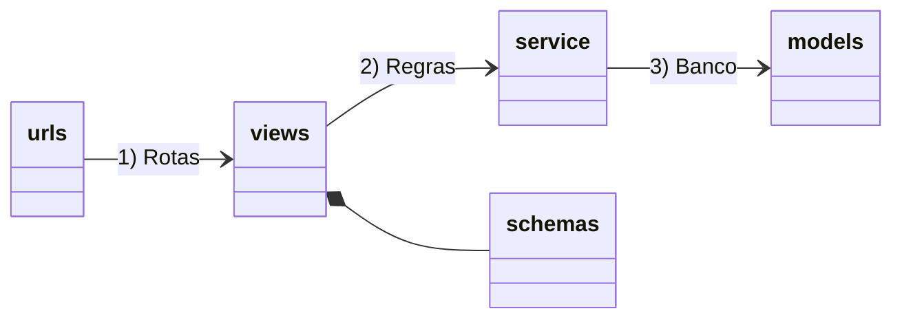
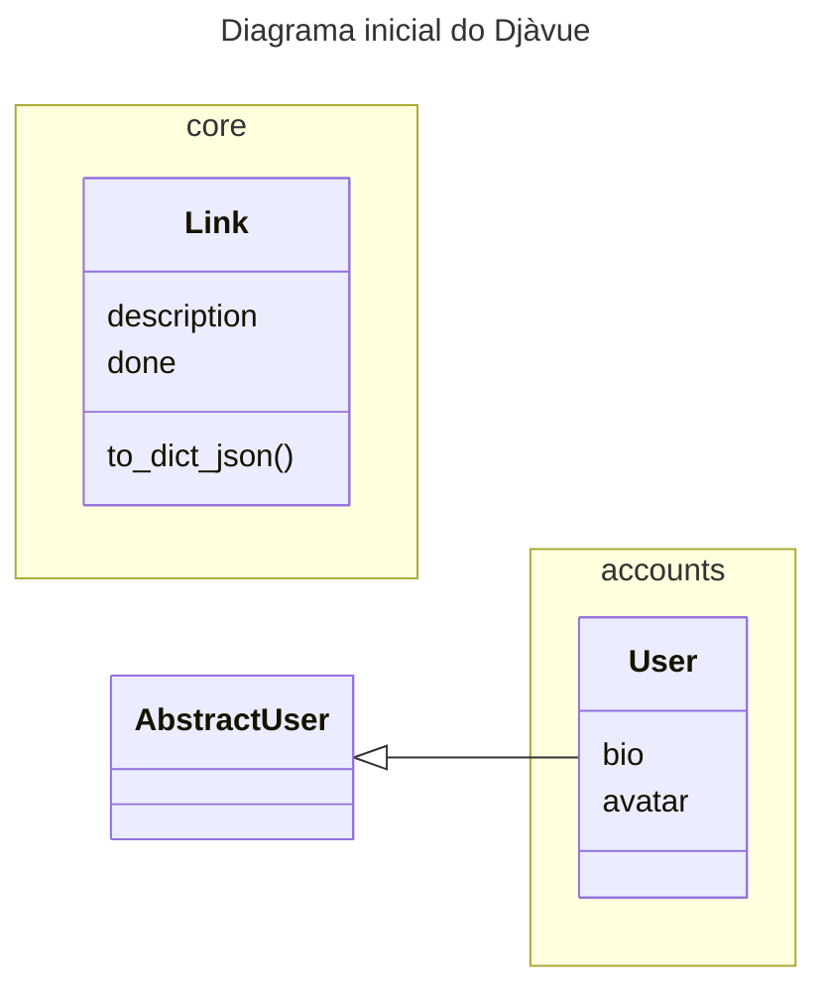

# 🏆 vailinks

## WHY?

É difícil lembrar das URLs que precisamos no dia a dia. Também queremos algo mais fácil que achar um bookmark salvo e por último algo que seja fácil de compartilhar e memorizar.
Não estou falando de um encurtador de URLs!

## WHAT?

Imagine você digitar no seu navegador: "vai djavue" e você redirecionado para o incrível template de projetos django [https://github.com/evolutio/djavue3](https://github.com/evolutio/djavue3), ou você digita "vai git" e uma página web lista os melhores LINKS sobre Git.
Ahh se não quiser utilizar seu navegador, pode configurar seu "laucher" para fazer exatamente a mesma coisa!


## HOW?

Este projeto, ainda na fase bem inicial (rascunho) tem inicialmente um URL que sabe procurar por palavras chaves e quando encontra um link faz a ação apropriada, exemplo:

```
djavue  👉  https://vai.fly.dev/api/core/search?q=djavue  👉  https://github.com/evolutio/djavue3
```

Desta maneira podemos cadastrar a url do "vai" no launcher no seu navegador favorito! simples assim!
E é claro, precisar ter uma conta para poder registrar novos links! 



## Gostou?

Achou legal a ideia, achou algum problema! sugestões? 👉 Entre em contato!


## Entendendo o projeto

Este projeto foi criado utilizando o gerador de projetos [D-jà Vue](https://github.com/evolutio/djavue3)

## BACKEND Django API

### Organização das camadas



- **Cliente**: Qualquer coisa que faz chamadas HTTP para a API
- **API**: Tem as definições de rotas e validação dos dados de entrada, sem ou pouca regras de negócio, redireciona os dados para a camada de serviço
- **Services**: Módulos python puro com a implementação das regras de negócio, é a camada que mais deve ser testada
- **ORM**: Mapeamento dos dados na base de dados


### Estrutura de pastas

Visao geral

```shell
vailinks                   👉 Pasta raiz do projeto
 ├── README.md
 ├── manage.py                     👉 Django CLI (Ponto de entrada)
 ├── pyproject.toml                👉 Dependencias principais
 ├── docker-compose.yml            👉 Descritor docker para rodar local
 ├── Dockerfile                    👉 Receita para rodar projeto
 ├── tox.ini
 └── vailinks              👉 base do projeto
    ├── base                       👉 app para regras fora do "core"
    │   └── ...
    ├── accounts                   👉 app relacionado a usuarios e autenticacao
    │   └── ...
    ├── core                       👉 app principal com o "core business" 
    │   └── ...
    └── vailinks           👉 centraliza configuracoes do projeto
        ├── api.py
        ├── settings.py            👉 Configuracoes principal do Django
        ├── urls.py                👉 Configuracao principal/inicial das rotas no Django
        └── wsgi.py
```

O Django tem o conceito de "apps" com a ideia de separar os contextos do seu projeto, ao invés de ter tudo na app principal, podemos ir criando novas apps como por exemplo, vendas, compras, estoque, relatórios, blog de forma a agrupar funcionalidades da mesma natureza. Cada app segue a estrutura abaixo: 



```shell
├── core                       👉 Raiz da django app para centralizar uma solução de um dado contexto
│   ├── apps.py                👉 Como um __init__ da app
│   ├── urls.py                👉 1) Definição das rotas (com django-ninja a urls fica vazia)
│   ├── views.py               👉 1) Implementação das rotas
│   ├── schemas.py             👉 1) Definição dos atributos nome/tipo 
│   ├── service                👉 2) Implementação das regras de negócio
│   ├── models.py              👉 3) Definição das tabelas para salvar os dados
│   ├── migrations             👉 3) Histórico de como criar/alterar as tabelas no banco de dados
│   ├── admin.py               👉 Configuração dos dados que podemos acessar via back-office
│   ├── tests                  👉 Centraliza os testes da app
│   └── templates              👉 Não utilizado nas apps de API, mas pode gerar páginas HTML


```

### Diagrama de Entidade e Relacionamento

- Inicialmente o projeto tem apenas uma tabela na aplicação principal (core): Link
- O Django já fornece a tabela de usuários (User), a qual está organizada na app accounts. Note que podemos adicionar campos adicionais na tabela de usuário.

**🌈 NOTA:** Em versões mais antigas do Django, a forma de adicionar campos extras na tabela User era utilizando a tabela `Profile` com um relacionamento 1 para 1 com a User. Na versão mais nova do Django, podemos estender a tabela user diretamente igual está feito na app `accounts.models.User`.



**🌈 NOTA:** A tabela Link poderia ter um relacionamento com usuário, onde cada usuário apenas visualiza suas tarefas, como este é um template de projeto e para tentar deixá-lo mais flexível e fácil de estender, inicialmente não tem este relacionamento.

## Rodando o projeto

## Requisitos

- Git
- 🐍 Python 3.9.x ou 3.11.x (para utilizar Poetry)
- Um terminal (de preferência um terminal Linux, é para funcionar em um terminal WSL no Windows)

Temos três formas para **Rodar** 🍨:
- Sem Docker 📦: Apenas **Python** (usando sqlite)
- Apenas Banco de dados usando 🐋 Docker (melhor para debug)
- Tudo usando Docker 🐋: **Docker** and **Docker compose** (tudo rodando com um comando)

Links:
- Para entender [rodar com ou sem docker](https://www.djavue.org/README_EN.html#%F0%9F%90%8B-run-locally-using-docker-vs-not-using-docker-containers)
- [Para rodar tudo com docker](https://www.djavue.org/README_EN.html#%F0%9F%90%8B-running-all-with-docker)
- [Para rodar sem docker](https://www.djavue.org/README_EN.html#%F0%9F%93%A6-running-the-%F0%9F%A6%84-backend-without-docker)
- [Rodando com Poetry](https://www.djavue.org/README_EN.html#%F0%9F%93%A6-package-management-with-poetry)
